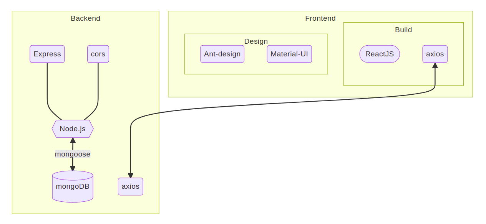

# [109-2] Web Programming Final

## (Group 23) Podomon 專注網站

組長：\
資工一 李昆昱 B09902069\
組員：\
資工一 蕭朵婕 B09902002\
資工一 羅邦齊 B08902146

### [Demo影片連結 youtu.be/OBFQIZM96vI](https://youtu.be/OBFQIZM96vI)


## 服務介紹

Podomon 是一個番茄鐘專注網站，名稱 Podomon 是結合精靈寶可夢 Pokemon 以及規劃時間必備的 Todo List 而成。在註冊後每位用戶都能從三隻各有特色的 podomon 中選出最喜歡的一隻，作為日後專注做事時陪伴在一旁的寵物，而在專注的總時數到達某程度時，寵物還會升級唷！每段專注的時間長短都可由用戶依據自身情況調整，從五分鐘到兩小時皆可，讓用戶能選擇出最適合自己的專注時長。除此之外，Todo List 中能新增 “提醒事項”、“每週目標”、“本日任務” 。而當訂出一個每週目標時，本日任務便會出現一個欄位讓用戶能每天依據每週目標訂定幾個任務，最終順利達成目標！除此之外，新增提醒事項的顏色有許多種供用戶能依據自己喜好選擇、搭配繽紛的色塊，做出一個專屬自己的 Todo List。Podomon 結合了番茄鐘計時器以及待辦清單的功能，搭配可愛療癒的介面設計，希望能讓用戶能把握時間，專注達成每一個目標。

## 服務功能
- Login Page
    - 註冊
        - 直接在 `username` `password` 欄位中輸入欲使用的用戶名和密碼, 再按下 `Register`即可註冊
        - 註冊後會跳出選擇專屬`Podomon`並為其命名之`modal`
    - 登入（已有帳號）
        - 直接在 `username` `password` 欄位中輸入用戶名和密碼, 再按下`Login`即可登入
- Todo List
    - Event Reminder
        - 行事曆功能
        - 由標題右方 `+` 呼叫新增 `modal`
        - 顏色可自由選擇
    - Weekly Goal
        - 可設立預定達成之目標
        - 由標題右方 `+` 呼叫新增 `modal`
        - 設立同時會在task區新增一 `Goal` 相關之 `collapse`
            - 用以儲存各 `Goal` 之 `Subtasks`
            - `Goal` 刪除時將一併刪除其 `Subtasks` collapse box
    - Task Today
        - 可新增今日任務及各目標之子任務
        - 由標題右方 `+` 呼叫新增 `modal`
        - 透過 `All` `Finish` `Todo` 切換查看各種狀態之任務
        - 最下方 `Clear Button` 會清除所有已完成的任務
- Pomodoro (蕃茄鐘)
    - 倒數計時 `Timer`
    - Slide bar
        - 可自訂每次專注所需時長
        - 可選範圍
            - 5分鐘～2小時
            - 5分鐘為一單位
    - Podomon！
        - 可愛＆療癒
        - 顯示鼓勵訊息
    - 按鍵區 `Buttons`
        - 開始 / 繼續 ▶️
            - 按下 ▶️  後, 一旦切換頁面或使用其他功能 => 系統會自動暫停計時並顯示警告通知
        - 暫停 ⏸️
        - 停止 ⏹️
- Info (透過 ⚙️  開啟查看)
    - Podomon相關資訊
    - 用戶累積專注時長


## [Deployed 連接 linux4.csie.org:3000](http://linux4.csie.org:3000)


### 使用 / 操作方式：
    使用者端：點入連結，註冊帳號後即可登入使用。
    伺服器端：不開放使用。

### 使用與參考之框架 / 模組 / 原始碼：
	主要使用 React, Axios, Express, Mongoose

### 使用之第三方套件、框架、程式碼：
	前端：Ant Design, Material-UI 
	後端：dotenv-defaults, nodemon, cors, MongoDB

### 程式架構



### Repo Structure

```
├── backend
│     └── src
│         ├── main.js
│         ├── mongo.js
│         ├── model
│         │    └── User.js
│         └── routes
│              ├── api
│              │    ├── handle.js
│              │    └── index.js
|              └── index.js 
├── frontend
│     └── src
│         ├── api.js
│         ├── App.js
│         ├── App.css
│         ├── index.js
│         ├── index.css
│         ├── components
│         |    ├── modals
│         |    │    ├── eventSetter.js
│         |    │    ├── goalSetter.js
│         |    │    ├── subTaskSetter.js
│         |    │    └── taskSetter.js
│         │    ├── sublist
│         |    │    ├── event
|         |    |    |    ├── eventBoard.js
|         |    |    |    └── eventCard.js
│         |    │    ├── goal
|         |    |    |    └── GoalBoard.js
│         |    |    └── task
|         |    |         ├── taskBoard.js
|         |    |         ├── goalSubs.js
|         |    |         └── box.css
|         |    ├── Buttons.js
|         |    ├── CreateModal.js
|         |    ├── PetModal.js
|         |    ├── SettingDrawer.js
|         |    ├── List.js
|         |    └── TodoList.js
│         ├── containers
│         |    ├── Login.js
|         |    └── Podomon.js
|         └── img
└── README.md
```

    
## 專題製作心得
### 李昆昱：
這份期末專題製作的過程中我負責的是比較後端的部分。這部分最挑戰的是要讓每個前端的請求都得到妥善的處理，就算出錯了也要將每個錯誤catch住，不然前端不會跳出錯誤訊息，而後端早已crash、斷開連線了。api的撰寫是這次遇到的大魔王，讓我終於體會惡名昭彰的javascript變數型態…捉摸不定的資料型態讓MongoDB拒絕存取而崩潰，讓我也崩潰了一陣子。不過後來在翻遍mongoose與mozilla的官方doc後終於找到了解決的方式，也順利的完成了後端api架設。
這次可能沒有做好的地方大概是資安的部分…在部署到伺服器時因為技術上一直出現問題，而折衷選擇了較不安全的http來連接前後端，不過這也讓我明白了自己較為不足的地方，我會試著去把自己欠缺的技能點亮。
這份期末專題我非常感謝我的隊友們。在視訊會議中我天馬行空提出來的奇怪想法、畫出來的簡陋概念圖都多虧了他們才能夠製作成成品。討論的過程中也和樂融融，而且大家看到哪裡還沒完成或是哪邊有bug都二話不說捲起袖子開始做，讓我非常之感動！謝謝你們！

### 蕭朵婕：
這學習修了網服這門課，從原本完全的網頁外行人到現在 final project 可以和隊友們合作架設出一個網站，真的很不可思議。而這次的 final project 我主要是寫前端 UI 設計的部分，雖然有時候排版或處理照片等等確實很麻煩，但看到有美美的畫面呈現出來就覺得好開心。而且合作寫 Project 實在很有趣，從一開始的主題開始發想，設計出各個頁面，到實際把成品做出來，功能的調整等等，都是要透過好多的溝通去完成的，而且雖然我們從頭到尾都沒有列分工表什麼的，但大家就是看到哪裡需要做就去把洞補起來，最後做出來的成品也很讓人滿意！超感謝隊友！

### 羅邦齊：
學期初因為想嘗試網路專案的建構而選擇修習了這門課程，從一開始只會用html建構超級陽春的文字黑白版面到可以結合JavaScript和CSS構建出繽紛且具有互動性的頁面，製作期末的專題的挑戰又比平常的作業更上一層樓，畢竟要真的完全從零開始建構一個完整的網頁，這次在專題中又重新複習了不少東西，同時為了網頁需求也多學習了不少新事物，但我想其中最珍貴的便是和隊友一起協作的經驗，在合作及分工之中共同完成目標的感覺格外有成就感，和隊友溝通和針對彼此意見調整成品呈現的過程也讓我能在團隊的運作中更加得心應手，非常開心可以有這個機會跟很棒的隊友一起完成這次的專題！


----
## localhost 安裝測試說明

此服務依賴遠端資料庫（MongoDB）方得運作，因此需在已連接網際網路之環境下運行、並自行準備MongoDB資料庫連結。


### 前端啟動方式
```
cd frontend
yarn install
yarn start
```

### 後端啟動方式

```
cd backend
```
在此目錄中打開 .env 文字檔，其內容為：
```
MONGO_URL=
```
請在等號之後輸入您的MongoDB資料庫連結並儲存。\
完成後繼續執行
```
yarn install
yarn server
```

待前端與後端皆啟動完成後，使用瀏覽器進入 http://localhost:3000/Podomon 即可使用

## 各組員負責部分

李昆昱：
* 編寫backend express 
* 編寫向backend發送請求的functions
* 建置mongoose schema
* 連接MongoDB
* 將服務deploy上雲端
* 畫了3隻寵物（蛋）

蕭朵婕：
* 設計前端使用者介面、寫CSS
* 處理圖片
* 組織前端components架構
* 製作倒數計時功能
* 撰寫此服務的介紹文
* 畫了3隻寵物+LOGO

羅邦齊：
* 設計Todo List的配色、界面、運作方式
* 完成Todo List的**所有功能**
* 撰寫寵物升等與記錄儲存的前、後端functions
* 製作防止分心警告功能
* 拍攝demo影片
* 畫了3隻寵物（狐狸）

